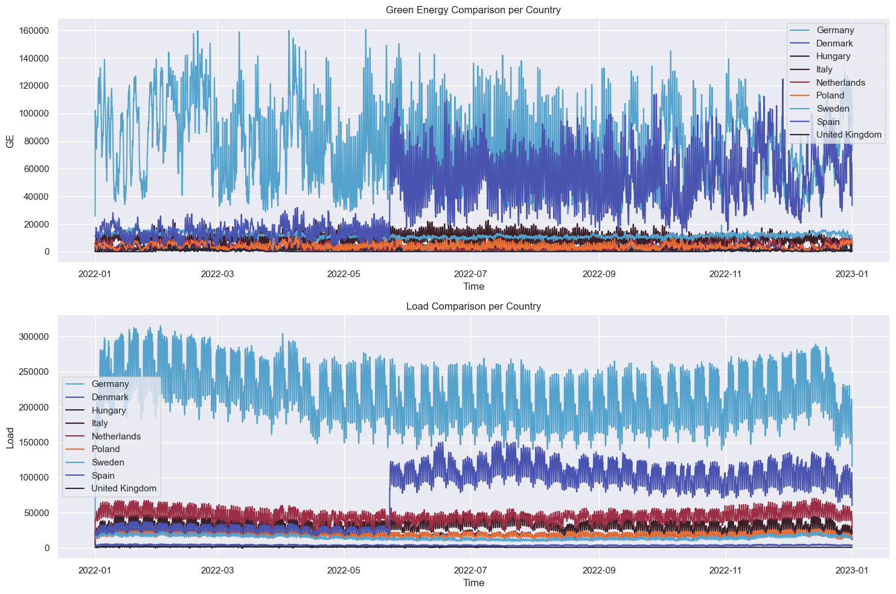

# Schneider Electric European Hackathon 2023
The SCHNEIDER ELECTRIC EUROPEAN HACKATHON is an innovation international competition organized by SCHNEIDER ELECTRIC and powered by NUWE. This hackathon will take place on Saturday November 18th and will be focused on the European territory.

---

**By:** Jorge Félix Martínez Pazos

**From:** Center for Computational Mathematics Studies. University of Informatics Sciences.

---

# EcoForecast Solution

## Overview

Our solution for the Schneider Electric European Hackathon 2023 is a set of EcoForecast models using Prophet, to predict the surplus of green energy for various european countries. 

## Data Pipeline

### Data Collection and Preprocessing

The data for our model is collected from the **ENTSO-E Transparency** portal, it will be saved in data/Raw Data. We apply an Extract, Transform, Load (ETL) process to the collected data, resulting in two CSV files: `merged_gen_data.csv` and `merged_load_data.csv` saved at data/Processed Data. These files contain the Green Energy Generation data and Energy Load data, respectively. All further data generater will be saved into data/Processed Data directory.

### Feature Engineering

The datasets undergo extensive processing, including feature engineering, changing the time resolution, and imputing NaN values using the mean of time windows, among other transformations. This results in the `EcoForecast Dataset`, which includes columns for each country's Green Energy (GE) and Load data.

The final feature engineering step involves calculating the Surplus for each country by subtracting the Energy Load from the Green Energy Generation. This provides us with a single target variable for each country that represents the net green energy surplus.

### Exploratory Data Analysis

An exploratory data analysis was conducted on this dataset, revealing insights about the patterns and trends in the data. For instance, even when Germany has a larger Load of Energy and a larger Generation of Green Energy most of the time, in some instances Denmark is capable of outperforming Germany in terms of GE, even having a lot less Load Energy.

### Model Training and Evaluation

#### Data Splitting and Scaling

The dataset is then split into training and testing sets, and individual MinMax Scalers are applied to each set. This ensures that the model is not unduly influenced by the scale of the different features.

#### Model Selection and Hyperparameter Tuning

The proposed model for our problem is Prophet, which we use in a somewhat unique way. We create and fine-tune multiple models, one for each country, to perform univariate forecasting and obtain better results. We then construct the `predict_surplus` function, which groups these country-specific models and datasets and makes future predictions for each one depending on the `n_periods`, returning a complete dataframe of forecasts.

This allows us to obtain the best possible results for the surplus forecast, which we then use with our `find_max_surplus_country` function (which is integrated into the entire process) to determine which country will have the highest surplus in the following hours.

### Execution

To execute the Data Pipeline, run the `run_pipeline.sh` script in your terminal.

### Documentation

For a detailed explanation of the entire process from data ingestion to predictions, refer to the `Solution.ipynb` notebook.

### Results

